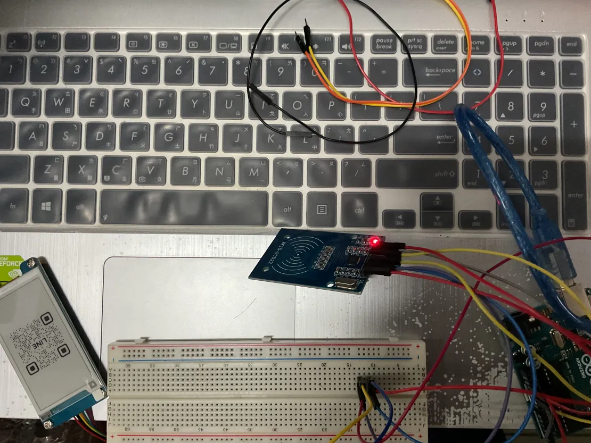
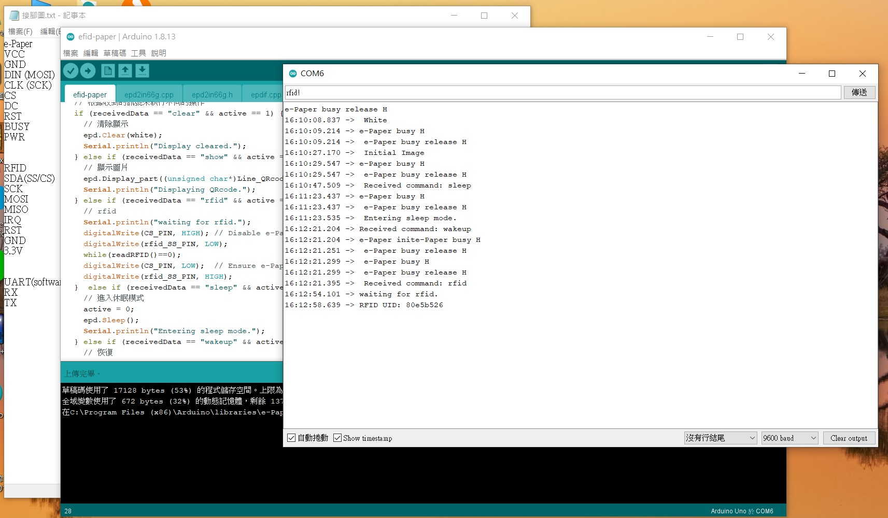

# Arduino 專案 - 電子紙與 RFID 通訊

本專案結合 Arduino UNO、電子紙 (e-Paper) 與 RFID 模組，實現數據讀取與顯示，並計劃與其他設備進行 UART 通訊。
另外該專案提供完整的硬體接線圖與數據收發範例圖，幫助使用者直觀了解操作流程。

## 目錄

- [專案簡介](#專案簡介)
- [硬體說明](#硬體說明)
- [接線對照表](#接線對照表)
- [使用指南](#使用指南)
  - [CS (Chip Select) 的原理](#cs-chip-select-的原理)
  - [必需的 Arduino 庫](#必需的-arduino-庫)
- [如何開始](#如何開始)
- [問題回報與貢獻](#問題回報與貢獻)
- [授權協議](#授權協議)

## 專案簡介

本專案結合電子紙與 RFID 模組，可透過 Arduino UNO 讀取 RFID 標籤資料同時操作電子紙。還可與其他設備進行 UART 通訊，並透過第 5 腳接收資料，實現更複雜的功能。專案提供詳細的硬體接線圖與數據收發範例，幫助使用者深入理解整體系統運作。

實體接線圖

實際收發圖 


## 硬體說明

### 電子紙 (e-Paper) 2.66inch e-Paper Module (G), 360x184

- **功能**：顯示靜態圖片，具有低功耗特性，適合長時間顯示固定資訊。
- **通訊接口**：透過 SPI 與 Arduino UNO 進行數據傳輸。
- **詳細資料**：參見官方文檔：[Waveshare 2.66inch e-Paper Module (G) Manual](https://www.waveshare.com/wiki/2.66inch_e-Paper_Module_(G)_Manual).

### RFID 模組

- **功能**：讀取 RFID 標籤，實現近距離無線識別。
- **通訊接口**：通過 SPI 與 Arduino UNO 連接，並提供額外控制引腳。

### UART (軟體模擬)

- **用途**：利用 UART 進行數據傳輸，實現與其設備的通訊。

## 接線對照表

### 電子紙 (e-Paper) 與 Arduino UNO

| e-Paper      | Arduino UNO |
|--------------|-------------|
| VCC          | 5V          |
| GND          | GND         |
| DIN (MOSI)   | D11         |
| CLK (SCK)    | D13         |
| CS           | D10         |
| DC           | D9          |
| RST          | D8          |
| BUSY         | D7          |
| PWR          | D6          |

### RFID 與 Arduino UNO

| RFID          | Arduino UNO |
|---------------|-------------|
| SDA (SS/CS)   | D3          |
| SCK           | D13         |
| MOSI          | D11         |
| MISO          | D12         |
| IRQ           | (no use)    |
| RST           | D2          |
| GND           | GND         |
| 3.3V          | 3.3V        |

### UART (軟體模擬) 與 Arduino UNO

| UART (Software) | Arduino UNO    |
|-----------------|----------------|
| RX              | D5             |
| TX              | D4 (no use)    |

## 使用指南

### CS (Chip Select) 的原理

在 SPI 通訊中，**CS (Chip Select)** 是用於選擇通訊目標裝置的控制信號。在多裝置共享 SPI 線路時，必須正確操作 CS 腳位以避免通訊衝突：
- **CS 拉低 (LOW)**：選中該裝置，開始數據傳輸。
- **CS 拉高 (HIGH)**：取消選中該裝置，該裝置將忽略 SPI 線上的數據。

### 必需的 Arduino 庫

以下是本專案所需的主要庫：
- **SPI**：內建庫，用於 SPI 通訊。
- **GxEPD2** 或 **GxEPD**：用於控制電子紙顯示，根據具體型號選擇合適的庫。
- **MFRC522**：用於操作 RFID 模組。
- **SoftwareSerial**：用於模擬額外的 UART 通訊，可擴展串口數量。但 SoftwareSerial 庫的包率受到限制。通常，SoftwareSerial 的穩定工作包率在 9600 到 19200 之間。

## 如何開始

1. **硬體連接**  
   根據接線對照表，將電子紙、RFID 模組和 UART 模組正確連接到 Arduino UNO。

2. **軟體設定**  
   - 下載並安裝 [Arduino IDE](https://www.arduino.cc/en/software)。
   - 下載或克隆專案：
     ```bash
     git clone https://github.com/10809104/arduino.git
     ```
   - 在 Arduino IDE 中選擇正確的開發板（Arduino UNO）與連接埠，並安裝必需的庫。

3. **程式上傳**  
   編譯並將程式上傳至 Arduino UNO，開啟序列監控器檢查數據傳輸。

4. **測試運行**  
   測試 RFID 模組是否能讀取標籤。以及確保電子紙正確顯示圖片。

## 問題回報與貢獻

如有問題或建議，請提出 Issue 或提交 Pull Request。若欲貢獻程式碼，請遵循以下流程：
- Fork 本專案，創建新分支 (`git checkout -b feature-name`)。
- 提交並推送更改至遠端 (`git push origin feature-name`)。
- 發起 Pull Request。

## 授權協議

本專案遵循 [MIT 授權條款](LICENSE)，在遵守授權條款的情況下，您可以自由使用、修改並分享本專案。

---

