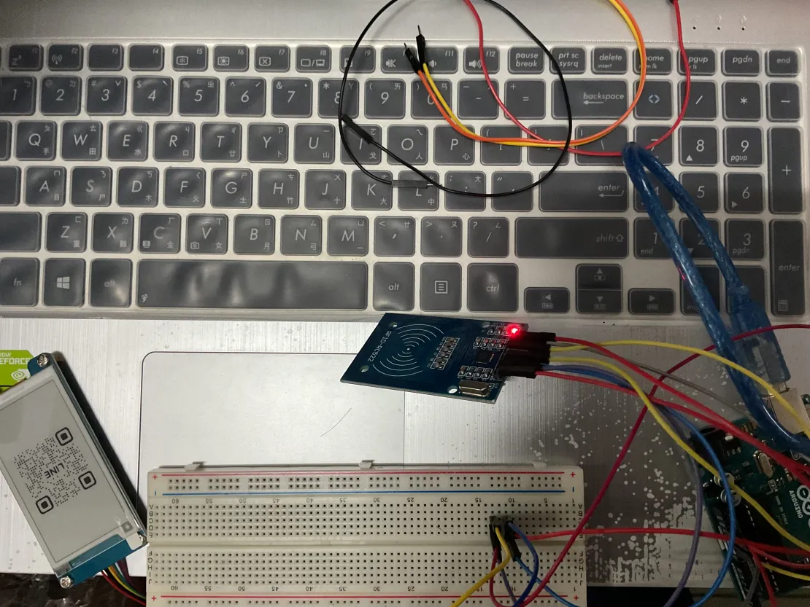
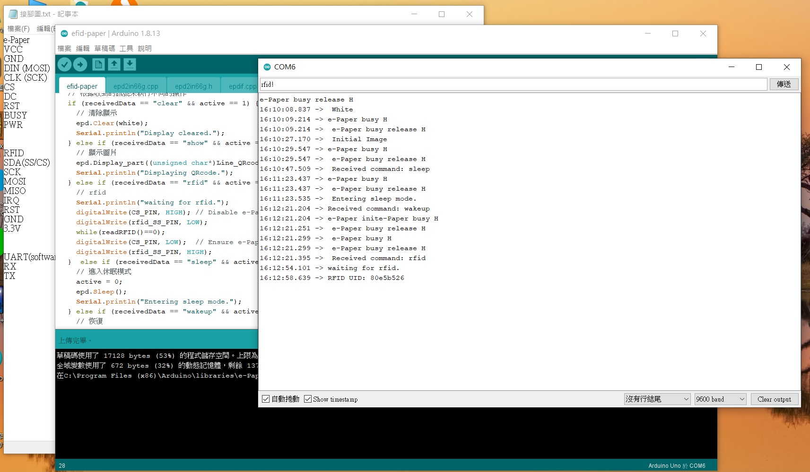

# Arduino 專案 - 電子紙與 RFID 通訊

本專案結合 Arduino UNO、電子紙 (e-Paper) 與 RFID 模組，實現數據讀取與顯示，並計劃與其他設備進行 UART 通訊。專案提供完整的硬體接線圖與數據收發範例，幫助使用者直觀了解操作流程。

## 目錄

- [專案簡介](#專案簡介)
- [硬體說明](#硬體說明)
- [接線對照表](#接線對照表)
- [使用指南](#使用指南)
- [必需的 Arduino 庫](#必需的-arduino-庫)
- [如何開始](#如何開始)
- [問題回報與貢獻](#問題回報與貢獻)
- [授權協議](#授權協議)

## 專案簡介

本專案結合電子紙與 RFID 模組，可透過 Arduino UNO 讀取 RFID 標籤資料同時操作電子紙。還可與其他設備進行 UART 通訊，並透過第 5 腳接收資料，實現更複雜的功能。專案提供詳細的硬體接線圖與數據收發範例，幫助使用者深入理解整體系統運作。
### 實體接線圖

以下是硬體接線圖，顯示了電子紙、RFID 模組與 Arduino UNO 的連接方式：



### 實際收發圖

此圖顯示了在實際運行中電子紙與 RFID 模組的數據收發過程：



## 硬體說明

### 電子紙 (e-Paper)

- **型號**：2.66 吋電子紙模組 (G)，解析度 360x184 (height * width)
- **功能**：顯示靜態圖片，具有低功耗特性，適合長時間顯示固定資訊。
- **通訊接口**：透過 SPI 與 Arduino UNO 進行數據傳輸。
- **詳細資料**：[官方文檔](https://www.waveshare.com/wiki/2.66inch_e-Paper_Module_(G)_Manual#Working_With_Arduino)

### RFID 模組

- **功能**：讀取 RFID 標籤，實現近距離無線識別。
- **通訊接口**：通過 SPI 與 Arduino UNO 連接。

### UART (軟體模擬)

- **用途**：利用 UART 進行數據傳輸，實現與其他設備的通訊。

## 接線對照表

### 電子紙 (e-Paper) 與 Arduino UNO

| e-Paper | Arduino UNO |
|---------|-------------|
| VCC     | 5V          |
| GND     | GND         |
| DIN (MOSI) | D11      |
| CLK (SCK) | D13       |
| CS      | D10         |
| DC      | D9          |
| RST     | D8          |
| BUSY    | D7          |
| PWR     | D6          |

### RFID 與 Arduino UNO

| RFID    | Arduino UNO |
|---------|-------------|
| SDA (SS/CS) | D3      |
| SCK     | D13         |
| MOSI    | D11         |
| MISO    | D12         |
| IRQ     | (未使用)    |
| RST     | D2          |
| GND     | GND         |
| 3.3V    | 3.3V        |

### UART (軟體模擬) 與 Arduino UNO

| UART (軟體模擬) | Arduino UNO |
|-----------------|-------------|
| RX              | D4          |
| TX              | D5          |

## 使用指南

### CS (Chip Select) 的原理

在 SPI 通訊中，CS (Chip Select) 是用於選擇通訊目標裝置的控制信號。在多裝置共享 SPI 線路時，必須正確操作 CS 腳位以避免通訊衝突：

- **CS 拉低/0 (LOW)**：選中該裝置，開始數據傳輸。
- **CS 拉高/1 (HIGH)**：取消選中該裝置，該裝置將忽略 SPI 線上的數據。

### ver1 與 ver2 之間的差異

此專案有兩個版本，ver1 和 ver2 之間的差異主要在於程式碼與架構：

- **ver1**：較為簡單的程式結構，較適合入門學習，控制電子紙和 RFID 模組的方式較為直接，主要用於顯示靜態圖片和資料。此版本較為簡單，專注於固定內容的顯示，適合初學者使用。
- **ver2**：進一步擴展了顯示功能，支援顯示變數文字。這意味著用戶可以顯示動態內容或來自感測器的數據。不過，由於 Arduino UNO 的記憶體限制，該版本最多只能顯示 24 個字元。因此，若需要顯示更多文字，則可能需要升級硬體或進行優化。

## 必需的 Arduino 庫

以下是本專案所需的主要庫：

- **SPI**：內建庫，用於 SPI 通訊。
- **GxEPD2 或 GxEPD**：用於控制電子紙顯示，根據具體型號選擇合適的庫。
- **MFRC522**：用於操作 RFID 模組。
- **SoftwareSerial**：用於模擬額外的 UART 通訊，可擴展串口數量。請注意，SoftwareSerial 庫的波特率受到限制，通常穩定工作波特率在 9600 到 19200 之間。

## 如何開始

### 硬體連接

根據接線對照表，將電子紙、RFID 模組和 UART 模組正確連接到 Arduino UNO。您可以參考下面的 [接線對照表](##接線對照表) 來進行連接。

確認您的硬體接線無誤後，您可以開始進行程式設置。

### 軟體設定

1. **下載並安裝 Arduino IDE**
   - 前往 [Arduino 官方網站](https://www.arduino.cc/en/software) 下載並安裝最新版本的 Arduino IDE。

2. **下載或克隆專案**
   - 克隆此專案至您的本地機器：
     ```bash
     git clone https://github.com/10809104/arduino.git
     ```

3. **安裝所需庫**
   - 打開 Arduino IDE，選擇「工具」->「庫管理員」，搜尋並安裝以下庫：
     - **SPI**：內建庫，負責與 SPI 設備的通訊。
     - **GxEPD2** 或 **GxEPD**：用於控制電子紙顯示。
     - **MFRC522**：用於操作 RFID 模組。
     - **SoftwareSerial**：用於模擬 UART 通訊。

4. **配置 Arduino IDE**
   - 在 Arduino IDE 中選擇您的開發板為 `Arduino UNO` 並選擇正確的連接埠。
   
5. **編譯並上傳程式**
   - 打開專案中的主程式碼文件（例如 `arduino.ino`）。
   - 按下「編譯」按鈕，檢查程式碼是否能正常編譯。
   - 按下「上傳」按鈕將程式碼上傳至 Arduino UNO。

6. **測試與運行**
   - 開啟 Arduino IDE 中的「序列監控器」，檢查數據是否能夠正確傳輸。
   - 測試 RFID 模組是否能正確讀取標籤。
   - 確保電子紙顯示正常：
     - 確認電子紙是否能正確顯示圖片或文字。若是顯示文字，請檢查是否顯示了預期的內容。根據程式碼的設定，電子紙應該會顯示自訂內容。
     - 如果顯示的內容有錯誤，檢查程式碼中與電子紙顯示相關的部分，並確保連接正確無誤。
     - 由於電子紙是靜態顯示裝置，因此需要較長時間才能更新顯示內容，請耐心等待。


## 問題回報與貢獻


如果您在使用過程中遇到問題或有任何建議，請使用 GitHub Issues 提出您的問題。若希望為此專案貢獻程式碼，請遵循以下流程：

1. **Fork 本專案**：將專案 Fork 到您的 GitHub 帳戶。
2. **創建新分支**：從 `main` 分支創建新分支：
   ```bash
   git checkout -b feature-name

## 授權協議
本專案遵循 MIT 授權條款，您可以自由使用、修改並分享本專案。請確保在使用或分發本專案時遵循該協議。

